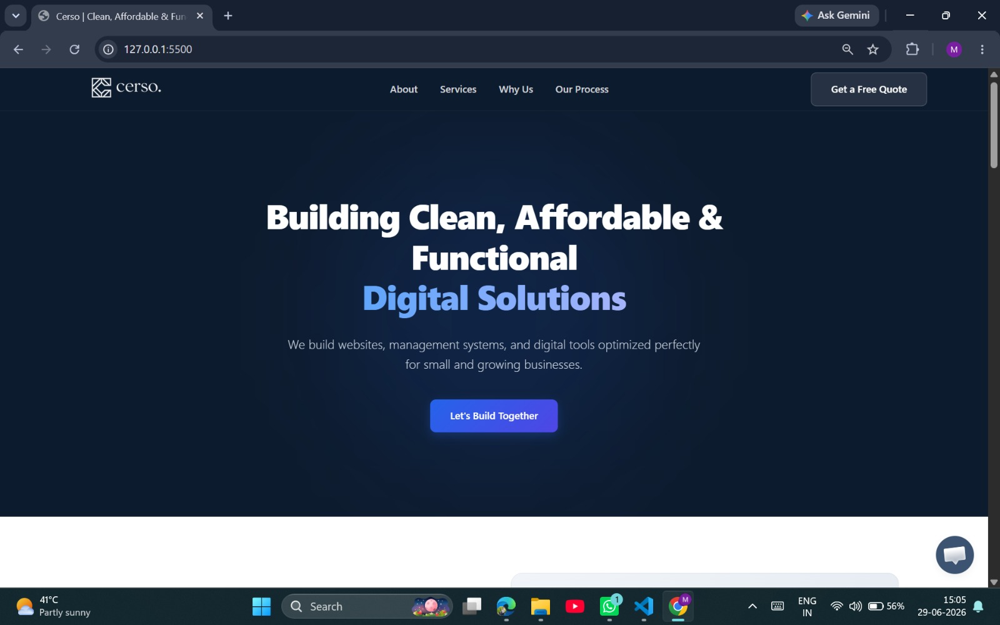
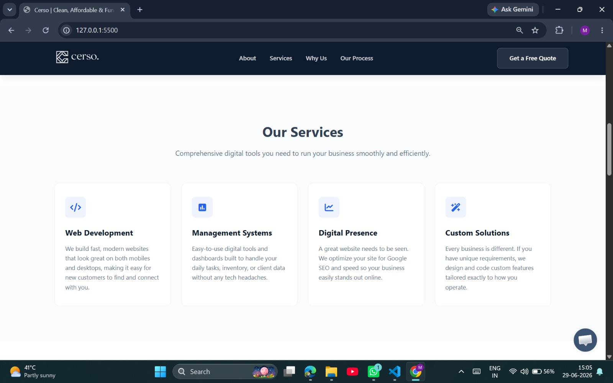
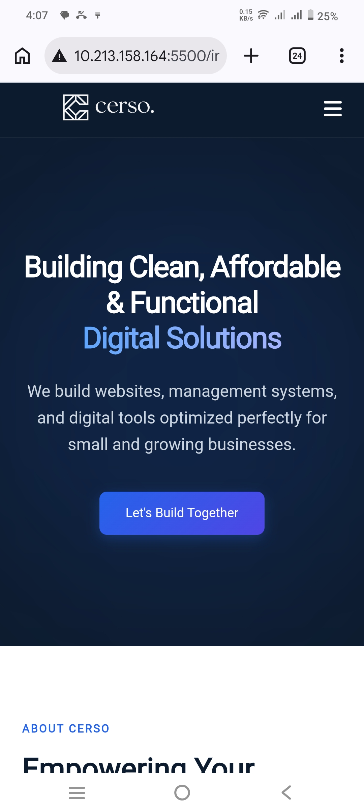

# Cerso | Business Landing Page

A modern and responsive business landing page developed for **Cerso** as part of my internship using **HTML, CSS, and JavaScript**. The project focuses on showcasing Cerso's services with a clean UI, responsive layout, and smooth user experience.

[](https://kaish10-hub.github.io/cerso-landing-page/)

## ✨ Features

-   Responsive design for mobile and desktop
-   Modern and clean UI
-   Smooth animations and transitions
-   Interactive mobile navigation menu
-   Services showcase section
-   About & process sections
-   Testimonials layout
-   Quote request/contact form
-   Sticky navigation header

## 📸 Screenshots

### Hero Section


### Services Section


### Mobile View Section
<p align="center">
  
</p>

## 🛠️ Tech Stack

-   HTML5
-   CSS3
-   JavaScript
-   Font Awesome

## 📂 Project Structure

```
/
├── index.html
├── style.css
├── script.js
├── cerso_logo.png
├── about-visual.png
└── README.md
```

## 📌 Sections Included
-  Hero Section
-  About Us
-  Services
-  Why Choose Us
-  Our Process
-  Client Testimonials
-  Contact / Quote Form
-  Footer

## 🚀 Run Locally

1.  Clone the repository:
   ```
  git clone https://github.com/kaish10-hub/cerso-landing-page
   ```
2.  Open the project folder:
  ```
  cd cerso-landing-page
  ```
3.  Run `index.html` using Live Server

## 🎯 Goal

To create a clean, affordable, and functional business website experience that helps small and growing businesses showcase services and generate client inquiries.

## 👨‍💻 Author

Made with ❤️ by Kaish
